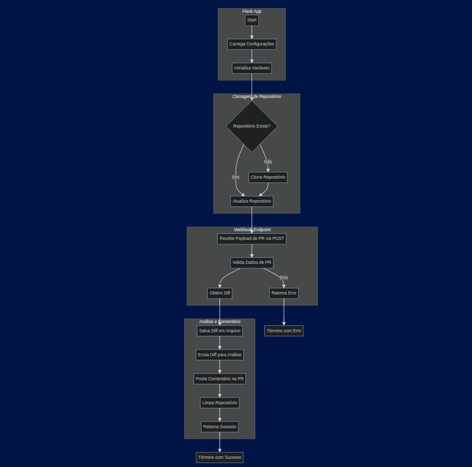
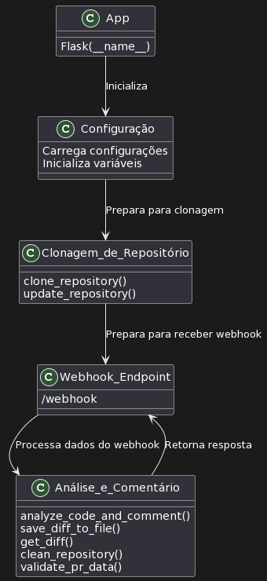
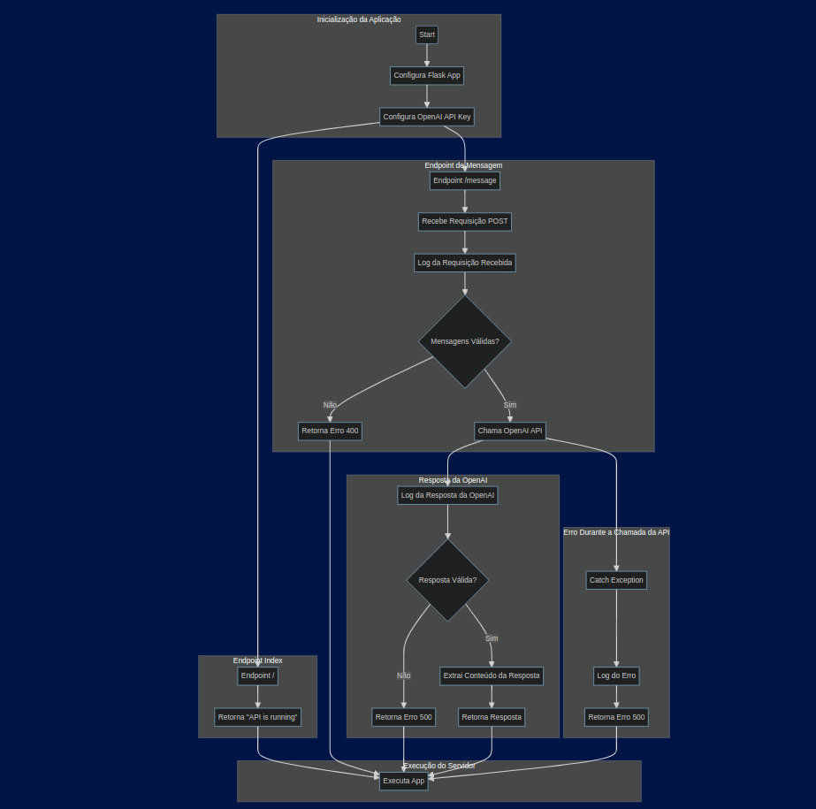
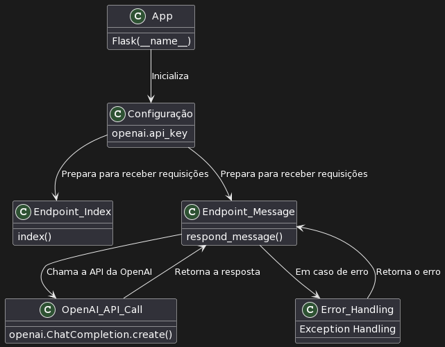

# Documentação para o Projeto de Análise de Pull Request

Este projeto é uma aplicação que interage com o Azure DevOps e a API da OpenAI para analisar pull requests e fornecer feedbacks automáticos com base nas mudanças propostas no código. A aplicação é dividida em dois componentes principais: um webhook para processar os eventos de pull request do Azure DevOps e uma API para comunicar-se com a API da OpenAI.


[](https://sonarcloud.io/summary/new_code?id=bob-reis_pr_analisys)


## Estrutura do Projeto
O projeto é composto pelos seguintes arquivos e diretórios:

- pullrequest-hook.py: O script principal que define o webhook e a lógica para processar os pull requests.
- api.py: Um script para definir uma API Flask simples que interage com a API da OpenAI.
- config.json: Um arquivo de configuração para definir o endpoint da API e o nome da organização no Azure DevOps.
- .env: Um arquivo para definir variáveis de ambiente, como as chaves API para o Azure e OpenAI.
- API.Dockerfile: Um Dockerfile para construir a imagem do container para a API.
- PR.Dockerfile: Um Dockerfile para construir a imagem do container para o webhook.
- requirements.txt: Um arquivo que lista todas as dependências necessárias para o projeto.

### Diagrama de Fluxos

Pull Request Hook - Flow Chart




Pull Request Hook - Plant UML




API - Flow Chart




API - Plant UML



## Pré-requisitos
- Uma conta no Azure DevOps com acesso a um repositório de código e permissões para configurar webhooks.
- Uma conta na OpenAI com acesso à API da OpenAI.
- Docker instalado no seu ambiente.
- (Opcional) Git instalado no seu ambiente, se você deseja clonar o repositório do GitHub.

## Configuração Inicial

1. Clone o Repositório:

Se você não baixou o código diretamente, clone o repositório do GitHub usando o seguinte comando:

```
git clone git@ssh.dev.azure.com:v3/Blockbit/DevOps/pr-analysis
cd pr-analysis
```

2. Configuração de Variáveis de Ambiente:

Abra o arquivo .env e configure as seguintes variáveis de ambiente:

```
OPENAI_API_KEY=<sua-chave-api-openai>
PAT_AZURE=<sua-chave-pat-azure>
```

3. Configuração do config.json:

Abra o arquivo config.json e configure o seguinte:

```
{
    "organization_name": "<nome-da-sua-organizacao>",
    "api_endpoint": "http://api:5000/message"
}
```


## Construção das Imagens Docker

1. Construa a imagem da API:

```
docker build -t api-image -f API.Dockerfile .
```

2. Construa a imagem do Webhook:

```
docker build -t pr-hook-image -f PR.Dockerfile .
```

## Execução dos Containers

1. Execute o container da API:

```
docker run -d --name api-container -p 5000:5000 api-image
```

2. Execute o container do Webhook:

```
docker run -d --name pr-hook-container -p 5001:5001 pr-hook-image
```

Agora, a aplicação estará rodando e escutando por eventos de pull request no Azure DevOps na porta 5001, e a API estará disponível na porta 5000.

## Configuração do Webhook no Azure DevOps

1. Vá para o Azure DevOps e navegue até o repositório que você deseja monitorar.
2. Vá para Settings -> Service Hooks.
3. Clique em + Create Subscription.
4. Selecione Web Hooks como o tipo de serviço e configure o webhook para disparar em eventos de pull request.
5. Defina a URL do webhook para http://<seu-endereço-ip>:5001/webhook.


Agora, sempre que um pull request for aberto, a aplicação irá capturar o diff, enviar para a API da OpenAI para análise, e postar o feedback como um comentário no pull request.